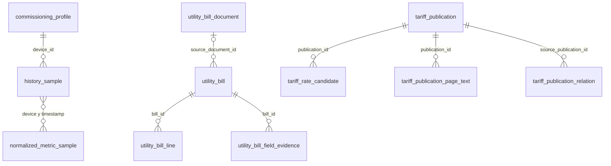

# Fase 11 — Guía de SQL y diccionario operativo (schema v17)

Estado: **IMPLEMENTACIÓN EN VALIDACIÓN CI**. No equivale a aceptación del propietario.
Ámbito: SQLite local, sin servicios externos, datos reales preservados.

## Cómo consultar

Abrir una **copia** de `Data/energy.db` con un cliente SQLite, preferiblemente en modo
solo lectura. En QA, la base activa utiliza por defecto
`D:\\SolarEnergyMonitorTest\\Data\\energy.db`.

La aplicación tiene SQLite WAL activo. No copiar únicamente `energy.db` mientras
se escribe en ella: usar el respaldo consistente generado por la aplicación.

Consultas iniciales:

```sql
PRAGMA query_only = ON;
PRAGMA integrity_check;
SELECT MAX(version) AS schema_version FROM schema_migration;
SELECT name, type FROM sqlite_master
WHERE type IN ('table','view') AND name NOT LIKE 'sqlite_%'
ORDER BY type, name;
SELECT * FROM data_quality_summary ORDER BY local_date DESC LIMIT 25;
SELECT * FROM reporting_grid_import ORDER BY recorded_at_utc DESC LIMIT 25;
SELECT * FROM reporting_hourly_power_samples ORDER BY utc_hour DESC LIMIT 25;
SELECT * FROM reporting_daily_power_samples ORDER BY utc_day DESC LIMIT 25;
SELECT * FROM reporting_battery ORDER BY recorded_at_utc DESC LIMIT 25;
SELECT * FROM reporting_utility_bills ORDER BY period_end_utc DESC LIMIT 25;
SELECT * FROM reporting_bill_line_evidence ORDER BY bill_id DESC, bill_line_id LIMIT 25;
```

### Vistas estables instaladas por migración 17

| Vista | Granularidad | Semántica |
|---|---|---|
| `reporting_grid_import` | Dispositivo × timestamp | Potencia importada en **W**, valor medido, calidad, confianza; **no** kWh |
| `reporting_hourly_power_samples` | Dispositivo × hora UTC × métrica | Conteo, media aritmética, mínimo y máximo de muestras **W**, no energía |
| `reporting_daily_power_samples` | Dispositivo × día UTC × métrica | Estadísticas de muestras **W**, no kWh ni día local |
| `reporting_battery` | Dispositivo × timestamp | SOC (%), voltaje (V), potencia (W); campos ausentes quedan NULL |
| `reporting_utility_bills` | Una boleta | Período, kWh facturados, sumario monetario y revisión; datos impresos |
| `reporting_bill_line_evidence` | Una línea de boleta | Importe real, categoría, origen y estado de evidencia |
| `data_quality_summary` | Dispositivo × día local | Cobertura de ingesta declarada por fuente, estados, conteos y extremos |

**Limitación deliberada:** ninguna vista afirma reconstruir kWh integrados
a partir de potencia sin respetar los timestamps reales, el umbral dinámico
de continuidad y los huecos. Los kWh observados se obtienen del motor de
estadísticas del producto; la reconstrucción monetaria también es calculada
dinámicamente y no se guarda como tabla persistida. Por ello
`reporting_daily_energy`, `reporting_hourly_energy` y
`reporting_bill_estimates` quedan **PENDIENTES** de diseño fiel al motor,
en lugar de publicar SQL conceptualmente incorrecto.

## Diccionario físico condensado

| Tabla | Clave/granularidad | Columnas esenciales |
|---|---|---|
| `schema_migration` | `version` | `applied_utc`, `description` |
| `app_setting` | `key` | `value`, `updated_utc`; puede contener configuración privada |
| `commissioning_profile` | `profile_id` | estación/dispositivo, perfil y capacidades; datos sensibles |
| `sync_run` | `sync_run_id` | inicio/fin/estado de ingesta |
| `raw_api_capture` | `capture_id` | payload de API, **no exportar sin saneamiento** |
| `history_sample` | `device_id,attribute_key,recorded_at_utc` | `value_json`, `is_missing`, `source`, `retrieved_utc` |
| `history_day_status` | `device_id,local_date` | `timezone`, `status`, `frame_count`, `page_count` |
| `normalized_metric_sample` | `device_id,metric_key,recorded_at_utc` | `normalized_value`, `normalized_unit`, `confidence`, `quality` |
| `normalization_run` | `normalization_run_id` | versión, conteos, resultado |
| `installation_config_check` | `device_id,check_key` | estado y comparación de configuración |
| `household_behavior_sample` | dispositivo/tiempo/versión | contexto de instalación; NO cambia métricas físicas |
| `utility_meter_reading` | `reading_id` | lectura acumulada kWh, fecha y precisión |
| `utility_bill` | `bill_id` | fechas, lecturas, kWh facturados, montos, precisión, PDF/revisión |
| `utility_bill_line` | `bill_line_id` | `bill_id`, categoría, cantidad, tasa, monto, evidencia |
| `utility_bill_document` | `document_id` | ubicación y huella de documento original |
| `utility_bill_field_evidence` | `evidence_id` | `bill_id`, campo, origen, estado de transcripción |
| `tariff_publication` | `publication_id` | proveedor, vigencia, retroactividad, SHA, PDF |
| `tariff_publication_page_text` | publicación/página | texto oficial extraído |
| `tariff_rate_candidate` | `rate_candidate_id` | componente, RED/ETR, tasa y estado; **candidato ≠ aplicabilidad confirmada** |
| `tariff_publication_relation` | `relation_id` | correcciones/reglas de precedencia documental |

Para obtener **todas** las columnas y tipos actualizados (autoridad ejecutable):

```sql
SELECT m.name AS tabla, p.cid, p.name AS columna,
       p.type, p."notnull", p.pk
FROM sqlite_master m
JOIN pragma_table_info(m.name) AS p
WHERE m.type='table' AND m.name NOT LIKE 'sqlite_%'
ORDER BY m.name, p.cid;
```

## Relación conceptual entre entidades



**Advertencia:** vínculos por `device_id` entre corpus son lógicos y no
todas las tablas poseen claves foráneas SQL. La publicación oficial no tiene
relación directa 1:1 a boleta: la selección se resuelve dinámicamente por
vigencias, versión, red y componentes.

## Consultas reproducibles adicionales

```sql
-- Cantidad de muestras, nunca consumo kWh
SELECT substr(recorded_at_utc,1,10) AS dia_utc,
       COUNT(*) AS muestras_con_valor,
       MIN(grid_import_power_w) AS minimo_w,
       MAX(grid_import_power_w) AS maximo_w
FROM reporting_grid_import
WHERE grid_import_power_w IS NOT NULL
GROUP BY substr(recorded_at_utc,1,10)
ORDER BY dia_utc DESC
LIMIT 31;

-- Boletas vs suma de sus líneas: la diferencia no justifica inventar un ajuste
SELECT b.bill_id, b.total_due_clp,
       SUM(l.amount_clp) AS subtotal_lineas_guardadas
FROM reporting_utility_bills b
LEFT JOIN reporting_bill_line_evidence l ON l.bill_id=b.bill_id
GROUP BY b.bill_id
ORDER BY b.bill_id DESC LIMIT 25;

-- Publicaciones normalizadas sin adjudicarles una aplicabilidad arbitraria
SELECT p.publication_id, p.effective_from, p.title,
       p.is_retroactive, COUNT(c.rate_candidate_id) AS candidatos
FROM tariff_publication p
LEFT JOIN tariff_rate_candidate c ON c.publication_id=p.publication_id
GROUP BY p.publication_id ORDER BY p.effective_from DESC LIMIT 25;
```

No usar `SUM(grid_import_power_w)` como energía. Para integración de W→kWh
se necesitan los intervalos reales entre muestras, exclusión de gaps y
cobertura; para día local se necesita la zona horaria de la estación.

## Diccionario semántico de columnas de las vistas

La exportación **Diagnóstico → Exportar evidencia Fases 10–12** genera
`schema_columns.csv` y `schema_foreign_keys.csv` con todas las columnas,
tipos, restricciones y relaciones físicas presentes **en esa base específica**.
Los archivos no incluyen valores de las tablas.

| Columna o familia | Descripción funcional |
|---|---|
| `device_id` | Identificador técnico de dispositivo; no un identificador de vivienda ni una descripción libre |
| `recorded_at_utc` | Instante original UTC de la muestra; se debe conservar su zona al interpretarlo |
| `grid_import_power_w`, `power_w` | Potencia eléctrica instantánea medida en W, no energía acumulada |
| `soc_pct`, `voltage_v` | Estado de carga de batería en porcentaje y tensión en voltios |
| `utc_hour`, `utc_day` | Prefijo horario o diario UTC; no representa día civil de Santiago |
| `sample_count` | Número de registros medidos no nulos en el grupo; no prueba cobertura continua |
| `sample_average_w` | Media **aritmética de muestras**, sin ponderación temporal |
| `sample_minimum_w`, `sample_maximum_w` | Extremos observados del grupo, no extremos garantizados del período |
| `confidence`, `quality`, `normalization_rule_version` | Metadatos de la normalización original que permiten distinguir incertidumbre y cambios de regla |
| `bill_id`, `bill_line_id` | Identificadores internos de una boleta guardada y de cada línea |
| `period_start_utc`, `period_end_utc`, `period_precision` | Límites originales; `DATE_ONLY` no significa que Enel midió a las 00:00 |
| `billed_consumption_kwh` | Energía facturada por la compañía, no consumo estimado del inversor |
| `taxable_amount_clp`, `iva_clp`, `exempt_amount_clp` | Importes impresos afectos, IVA y exentos de una boleta real |
| `gross_bill_amount_clp`, `other_charges_clp`, `previous_balance_clp`, `total_due_clp` | Cuadratura de la boleta real; no son tarifas reconstruidas |
| `amount_clp`, `unit_rate_clp`, `quantity`, `unit` | Importes, tasas y cantidades **guardados** en líneas reales |
| `source_kind`, `review_state`, `evidence_state` | Procedencia, estado de revisión y estado de evidencia; no son certificados de exactitud automática |
| `local_date`, `timezone`, `frame_count`, `page_count`, `status` | Fecha local, zona, volumen y estado registrados durante ingesta, no la cobertura física final de un informe |

**Sin falsa equivalencia:** un valor faltante (`NULL`) no se convierte en
cero automáticamente. Las vistas no contienen credenciales ni JSON crudo
de API. Para explicar tarifas reconstruidas utiliza Auditoría y su ZIP
técnico; el SQL de boletas muestra los hechos originales almacenados.

## Criterio de aceptación pendiente

Migración v16→v17 reproducible; consultas de vistas PASS en CI; revisión
de base real por QA sin alteración destructiva; completar vistas energéticas
solo cuando sean demostrablemente equivalentes al motor estadístico.

## Navegación del Explorador SQL — paginación limitada (Build 774, código 2026-10-09)

La pantalla **Datos y herramientas → Explorador SQL** ya dispone de editor de SELECT/WITH
de solo lectura, resaltado de sintaxis, resultados tabulares y exportación
**CSV UTF-8 / XLSX**. La ampliación añade navegación **Anterior/Siguiente**:

- **200 filas por página**, con indicador del rango mostrado. El máximo
  desplazamiento inicial es **50.000 filas**; si existen más filas al alcanzar
  ese límite, se indica claramente **límite de navegación** y se ofrece exportar
  el SELECT completo. No se anuncia falsamente «fin de resultados».
- El texto SQL ejecutado se conserva para la página actual; al **editar**
  la consulta se invalidan los botones y los desplazamientos anteriores.
  Ejecutar una consulta nueva reinicia la navegación en la primera página.
- Las páginas se ejecutan con conexión SQLite **read-only**, autorizador nativo
  de operaciones permitidas, cancelación y presupuesto temporal. La
  aplicación no almacena 50.000 filas para navegar: descarta las previas
  durante la lectura, mantiene únicamente la página solicitada en memoria
  y no modifica SQLite.
- **Recomendación:** incluir un `ORDER BY` suficientemente específico para
  que la paginación tenga orden reproducible. Las páginas son consultas
  separadas contra una base potencialmente cambiante: no se promete
  un «snapshot» consistente entre una página y la siguiente.
- **Exportar CSV/XLSX** sigue volviendo a ejecutar el SELECT **completo**,
  independiente de la página visible. Mantiene el archivo temporal no
  publicado en caso de error o cancelación, los límites de exportación y
  la neutralización existente de fórmulas al exportar.

Pruebas sintéticas agregadas: página de 200 y cola de 17 registros, página
vacía posterior, desplazamientos inválidos, cancelación de página y página
del límite de 50.000 con más datos todavía existentes. Ninguna prueba
usa la base de datos ni el Windows del propietario. El QA visual y de
rendimiento con base real se reserva para la **única prueba consolidada**
posterior; esta funcionalidad todavía no equivale a aceptación del producto.
